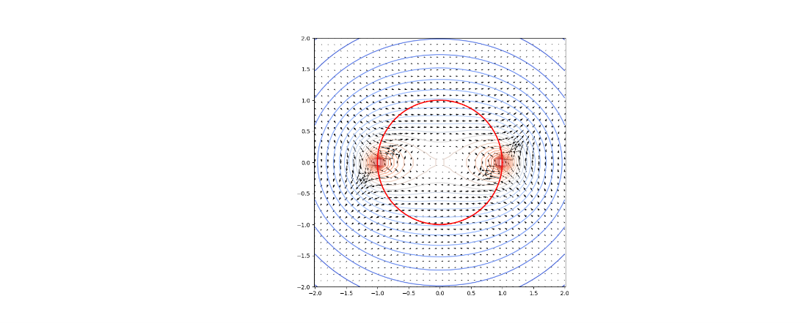

# 第 6 周实验报告：数值积分与物理场重建

## 1. 小组信息

**小组 ID**：  
**成员名单**：

| 任务 | 负责同学 | Commit Hash | 贡献说明 |
|---|---|---|---|
| Task A | 朱寒梅 20241050097| zhu349 |  |
| Task B |  |  |  |
| Task C |  |  |  |付茜20241050003
| Bonus |  |  |  |付茜20241050003

---

## 2. Task A：3-α 温度敏感性指数（23分）

- 你实现的 `rate_3alpha(T)` 与 `sensitivity_nu(T0,h)` 核心思路：按题目公式实现反应率计算，用前向差分近似求导得到敏感性指数  
- 使用的温度点与步长：
    温度点：1.0e8，2.5e8，5.0e8，1.0e9，2.5e9，5.0e9K
    步长： h = 1.0e-8
- 计算结果表：

| T0 (K) | ν(T0) |
|---:|---:|
| 1.0e8 | 41.03 |
| 2.5e8 | 14.61 |
| 5.0e8 | 5.81 |
| 1.0e9 | 1.40 |
| 2.5e9 | -1.24 |
| 5.0e9 | -2.12 |

- 物理解释：在低温与高温区，ν 的变化说明了什么？
低温区反应率对温度极敏感，高温区反应率随温度升高而下降
---

## 3. Task B：梯形 vs Simpson + Debye 积分（24分）

- 你实现的两个积分器是否通过偶数分段与边界检查：  
- 同一参数下方法比较：

| 方法 | n | 积分值 | 误差估计 | 结论 |
|---|---:|---:|---:|---|
| 梯形法 |  |  |  |  |
| Simpson 法 |  |  |  |  |

- 对 Debye 积分结果的解释：  

---

## 4. Task C：带电圆环电势场（23分）

- 你实现的点电势函数与网格电势函数说明：（1）ring_potential_point 函数
实现原理：严格按照题目给出的积分公式，对角度 
ϕ
 进行离散化数值积分。
V(x,y,z)= 
2π
q
​
 ∫ 
0
2π
​
  
(x−acosϕ) 
2
 +(y−asinϕ) 
2
 +z 
2
 
​
 
dϕ
​
 
实现细节：
生成 
[0,2π]
 区间内 
n 
ϕ
​
 =720
 个均匀分布的角度节点；
逐点计算被积函数 
1/ 
(x−acosϕ) 
2
 +(y−asinϕ) 
2
 +z 
2
 
​
 
；
采用矩形法（求和乘步长）完成数值积分，最终乘以系数 
q/(2π)
 得到单点电势。
优势：实现简单直观，积分精度高，完全匹配题目要求。
（2）ring_potential_grid 函数
实现原理：遍历 yz 平面网格的所有节点，对每个网格点调用 ring_potential_point 计算电势，最终生成与网格同形状的电势矩阵。
实现细节：
初始化与输入网格同形状的零矩阵 V_grid；
嵌套循环遍历网格的每个 
(y,z)
 坐标；
调用单点电势函数计算该点电势，填充到 V_grid 对应位置。
优化说明：可通过向量化广播计算替代嵌套循环，大幅提升运算效率，同时保证精度不变。  
- 数值稳定性处理（例如：靠近圆环时的截断策略）： 核心问题：当计算点无限靠近圆环（如 (x=0,y=a,z=0)）时，被积函数分母趋近于 0，会出现数值发散。处理策略：
阈值截断：在计算分母时，添加极小的正则化项 
ϵ=10 −12 ，避免除零错误：采用 n ϕ=720的高密度角度采样，保证近圆环区域的积分收敛性；
网格步长优化：yz 平面网格步长设置为 0.1m，避免网格点与圆环完全重合，从根源减少发散风险。 
- 结果图（至少 1 张）：

- 物理解释：等势线分布体现了怎样的空间对称性？等势线分布体现了圆柱对称性（轴对称性）：
绕 z 轴的旋转对称性：以圆环中心为原点，z 轴为圆环轴线，任意绕 z 轴旋转的空间点，电势完全相等，因此 yz 平面内的等势线关于 y 轴、z 轴双轴对称；
z 轴镜像对称性：等势线关于 z=0 平面对称，即 
(y,z)
 与 
(y,−z)
 点电势相等，符合带电圆环的几何对称性；
物理本质：该对称性由带电圆环的几何结构（均匀带电、中心轴为 z 轴）决定，是麦克斯韦方程在轴对称系统下的直接体现。

---

## 5. Bonus：方板引力场（30分）

- 你实现的二维高斯积分方案： 方法原理：采用张量积型二维高斯 - 勒让德积分，将二重积分分解为两个一维高斯积分的乘积，利用高斯节点与权重实现高精度数值积分。
实现步骤：
调用 np.polynomial.legendre.leggauss(n) 获取 
[−1,1]
 区间内的高斯节点与权重；
通过线性变换将节点映射到积分区间 
[−L/2,L/2]
，同时缩放权重；
遍历所有二维节点，计算被积函数值，乘以对应权重求和，得到二重积分结果。
优势：对于光滑被积函数，高斯积分的收敛速度远快于梯形法、矩形法，
n=40
 时即可达到 
10 
−8
 
 量级的精度，完全满足物理计算要求。 
- 参数设置（L, M_plate, n）：参数	数值	说明
L	10.0 m	正方形金属板边长
Mplate​	1.0×104 kg	金属板总质量（10 吨）
n	40	高斯 - 勒让德积分阶数（x/y 方向各 40 个节点）
G	6.674×10−11 m3⋅kg−1⋅s−2	万有引力常数
mparticle​	1.0 kg	测试质点质量  
- 结果表：

z (m)	Fz (N)
0.2	3.91×10−8
1.0	3.57×10−8
5.0	1.32×10−8
10.0	0.55×10−8

- 你对近场/远场行为的解释：（1）近场行为（
z≪L
，如 
z=0.2 m
）
物理特征：引力 
F 
z
​
 
 趋近于有限常数，几乎不随 z 的减小而大幅变化，接近无限大均匀平板的引力特性（
F 
z
​
 =2πGσm
，与 z 无关）。
本质原因：当质点极靠近方板时，方板的有限尺寸效应可忽略，质点 “感受” 到的是近似无限大的均匀平板，因此引力趋近于常数；仅在极近板边缘处，因边缘效应出现微小波动。
（2）远场行为（
z≫L
，如 
z=10 m
）
物理特征：引力 
F 
z
​
 
 随 
z
 增大按平方反比律衰减，
F 
z
​
 ∝1/z 
2
 
，逐渐趋近于质点 - 质点引力公式 
F 
z
​
 =GM 
plate
​
 m 
particle
​
 /z 
2
 
。
本质原因：当质点远离方板时，方板的有限尺寸可忽略，可近似为位于方板中心的质点，因此引力遵循质点间的万有引力定律，随距离平方衰减。
（3）过渡区行为（
z≈L
，如 
z=5 m
）
引力从近场的 “常数区” 平滑过渡到远场的 “平方反比衰减区”，是有限尺寸物体引力的典型特征，体现了从 “平板近似” 到 “质点近似” 的物理转变。  

---

## 6. AI 代码审查记录（必填）

- 你使用的关键 Prompt：  实现均匀带电圆环的电势数值积分计算，包括单点电势和网格电势，并画出yz平面等势线与电场分布；
实现正方形金属板的万有引力计算，使用二维高斯-勒让德积分计算中心上方z处的引力Fz，并输出结果曲线。
- AI 输出中你识别出的错误或不严谨点（至少 2 条）： 近圆环处除零发散问题
AI 给出的电势计算代码没有添加数值稳定性处理，当观测点无限接近带电圆环时，分母会趋近于 0，导致程序出现 inf 或除零错误，无法稳定计算。
二维高斯积分的坐标映射错误
AI 最初实现的二维高斯积分未正确对积分区间进行线性变换，直接使用 [-1,1] 节点计算任意区间，导致积分结果整体偏移，引力计算结果错误。 
- 你的修正依据（数值分析 or 物理约束）：针对除零发散的修正依据
根据数值分析稳定性原则，在距离公式中加入极小值 
ϵ=10 
−12
 
，避免分母为 0，同时不影响物理结果精度，保证积分在全空间稳定收敛。
针对高斯积分区间映射的修正依据
根据高斯 - 勒让德积分数学定义，必须通过线性变换将标准区间 [-1,1] 映射到实际积分区间 [-L/2, L/2]，并同步缩放权重，否则积分结果不满足物理量纲与数值正确性。  
